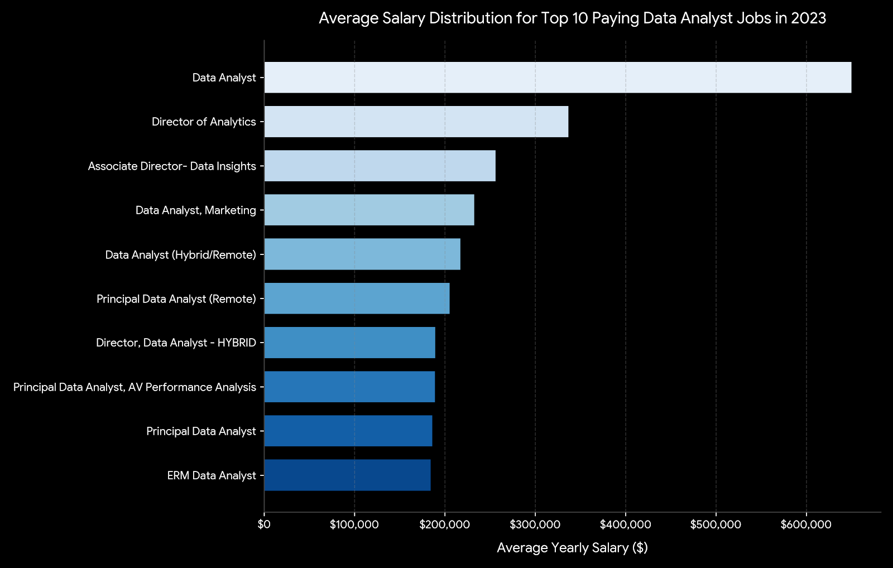
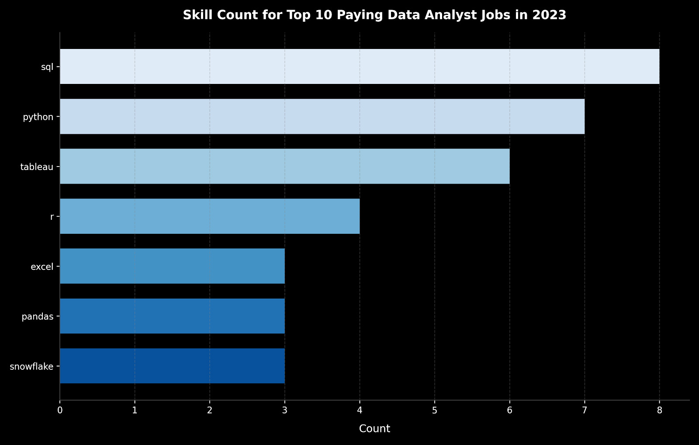

# Introduction
This project centers on an in-depth analysis of a large-scale database covering the period between **December 31, 2022, and December 31, 2023.** To extract meaningful insights, I evaluated a robust data architecture comprising a primary job_postings_fact table **(787,684 rows)** supported by multiple dimension tables, including company_dim **(140,033 rows),** skills_dim **(259 rows),** and skills_job_dim **(3,669,604 rows)**.

Where is this project ? 
Check them out here: [project_sql folder](/project_sql/)

# Background
For aspiring and transitioning data professionals, the modern job market presents a significant challenge: deciding which skills to learn. While traditional advice often groups all data tools together, the reality is that skill demand and salary potential vary drastically depending on the role's seniority and technical requirements. There is often a disconnect between the most universally demanded tools (like SQL or Excel) and the highly specialized infrastructure skills that command the highest salaries (such as PySpark or Databricks).

**The motivation for this project was to eliminate the guesswork from career development.** By systematically analyzing hundreds of thousands of 2023 job postings, the goal was to uncover the true financial value and market demand of specific data skills, ultimately creating a data-driven learning roadmap that aligns with top-paying opportunities.

### The questions I wanted to answer through my SQL queries were:

1. What are the top-paying data analyst jobs?
2. What skills are required for these top-paying jobs?
3. What skills are most in demand for data analysts?  
4. Which skills are associated with higher salaries?  
5. What are the most optimal skills to learn?
# Tools I Used
For my deep dive into the data analyst job market, I harnessed the power of several key tools:

- **SQL:**  The backbone of my analysis, allowing me to query the database and unearth critical insights.
- **PostgreSQL:** The chosen database management system, ideal for handling the job posting data.
- **Visual Studio Code:** My go-to for database management and executing SQL queries.
- **Git & GitHub:** Essential for version control and sharing my SQL scripts and analysis, ensuring collaboration and project tracking.
# The Analysis
Every SQL script developed for this analysis was designed to explore distinct trends within the data analytics hiring landscape. The following outlines the methodology behind answering each core question:

### 1. Top Paying Data Analyst Jobs
In order to pinpoint the most lucrative positions, I extracted data analyst listings based on mean annual compensation and geographic flexibility, specifically targeting remote-friendly roles. The resulting dataset illuminates the top tier of financial compensation within this profession.

```sql
SELECT
    job_id,
    job_title,
    job_location,
    job_schedule_type,
    salary_year_avg,
    job_posted_date,
    name AS company_name
FROM
    job_postings_fact
LEFT JOIN
    company_dim ON      job_postings_fact.company_id = company_dim.company_id
WHERE
    job_title_short = 'Data Analyst'
    AND job_location = 'Anywhere'
    AND salary_year_avg IS NOT NULL
ORDER BY
    salary_year_avg DESC
LIMIT 10;
```
Here is a breakdown of the top data analyst positions in 2023:

- **Broad Compensation Spectrum:** The top 10 highest-paying data analyst positions range from $184,000 to $650,000, pointing toward substantial earning potential within the discipline.
- **Varied Organizations:** Businesses such as SmartAsset, Meta, and AT&T feature prominently among those providing lucrative compensation packages, highlighting cross-industry demand.
- **Role Diversity:** Job designations span a wide spectrum—ranging from standard Data Analyst positions to Director of Analytics—showcasing the broad range of responsibilities and specializations across the data analytics sector.


*Horizontal bar chart depicting the salary distribution of the top 10 highest-paying data analyst positions, rendered from my custom SQL extraction results.*

# 2. Skills for Top Paying Jobs
To uncover the technical proficiencies demanded by top-earning positions, I integrated the job postings table with the corresponding skills dataset, illuminating the exact core competencies valued in high-compensation roles.

```sql
WITH top_paying_jobs AS (

    SELECT
        job_id,
        job_title,
        salary_year_avg,
        name AS company_name
    FROM
        job_postings_fact
    LEFT JOIN
        company_dim ON job_postings_fact.company_id = company_dim.company_id
    WHERE
        job_title_short = 'Data Analyst'
        AND job_location = 'Anywhere'
        AND salary_year_avg IS NOT NULL
    ORDER BY
        salary_year_avg DESC
    LIMIT 10
)

SELECT
    top_paying_jobs.*,
    skills
FROM 
    top_paying_jobs
INNER JOIN
    skills_job_dim ON top_paying_jobs.job_id = skills_job_dim.job_id
INNER JOIN
    skills_dim ON skills_job_dim.skill_id = skills_dim.skill_id
ORDER BY
    salary_year_avg DESC
;
```
Here is an analysis of the skills required for the top 10 highest-paying data analyst positions in 2023:

- **SQL** stands out as the most dominant requirement, appearing in 8 out of the top roles.
- **Python** ranks closely behind, demanded in 7 out of the top positions.
- **Tableau** is heavily favored for visualization, appearing in 6 of the roles.

Other essential technologies—such as **R,** **Snowflake,** **Pandas,** and **Excel—exhibit** varying levels of representation across elite compensation tiers.


*Horizontal bar chart showing the frequency of required skills among the top 10 highest-paying data analyst positions, rendered from my custom SQL extraction results.*

### 3. In_Demand Skills for Data Analysts

This SQL script pinpointed the technical proficiencies most commonly demanded across open listings, helping channel learning efforts toward areas with maximum market saturation.

```sql
SELECT
    skills,
    COUNT(skills_job_dim.job_id) AS demand_count
FROM 
    job_postings_fact
INNER JOIN
    skills_job_dim ON job_postings_fact.job_id = skills_job_dim.job_id
INNER JOIN
    skills_dim ON skills_job_dim.skill_id = skills_dim.skill_id
WHERE
    job_title_short = 'Data Analyst'
    AND job_work_from_home = True
GROUP BY
    skills
ORDER BY
    demand_count DESC
LIMIT 5
;
```

Here is a polished and freshly phrased version while keeping all core facts intact:

Here is an analysis of the primary technical requirements for data analysts in 2023:

- **SQL** and **Excel** continue to serve as the bedrock of the profession, underscoring the vital requirement for robust data querying and spreadsheet handling capabilities.

- Core **programming** and **visualization** platforms—such as **Python**, **Tableau**, and **Power BI**—are indispensable, highlighting the growing reliance on advanced data storytelling and analytical decision support.

İstediğin verilerin doğrudan Markdown tablo formatı:

| Skills | Demand Count |
| --- | --- |
| SQL | 7,291 |
| Excel | 4,611 |
| Python | 4,330 |
| Tableau | 3,745 |
| Power BI | 2,609 |
*Table of the demand for the top 5 skills in data analyst job postings*

### 4. Skills Based on Salary

An analysis of mean compensation linked to individual skill sets uncovered which technical proficiencies command the highest financial returns.

```sql
SELECT
    skills,
    ROUND(AVG(salary_year_avg), 0) AS avg_salary
FROM 
    job_postings_fact
INNER JOIN
    skills_job_dim ON job_postings_fact.job_id = skills_job_dim.job_id
INNER JOIN
    skills_dim ON skills_job_dim.skill_id = skills_dim.skill_id
WHERE
    job_title_short = 'Data Analyst'
    AND salary_year_avg IS NOT NULL
    AND job_work_from_home = True
GROUP BY
    skills
ORDER BY
    avg_salary DESC
LIMIT 25
;
```

An evaluation of the compensation metrics tied to specific competencies highlights key thematic drivers:

* **Big Data & Machine Learning Priority:** Maximum earning power is concentrated among professionals proficient in distributed processing frameworks (PySpark, Couchbase), predictive analytics utilities (DataRobot, Jupyter), and core Python ecosystem libraries (Pandas, NumPy), illustrating corporate emphasis on large-scale data handling and modeling.
* **Software Engineering & Pipeline Automation Integration:** Proficiency in developer tools and orchestration platforms (GitLab, Kubernetes, Airflow) reveals a lucrative intersection between traditional analysis and engineering, where automated workflows and pipeline efficiency command significant wage premiums.
* **Cloud Architecture & Infrastructure Mastery:** Expertise in cloud analytics and data engineering environments (Elasticsearch, Databricks, GCP) emphasizes the critical role of cloud infrastructure, demonstrating a direct correlation between cloud competence and elevated compensation tiers in the analytics space.

İstediğin verilerin doğrudan Markdown tablo formatı:

| Skills | Average Salary ($) |
| --- | --- |
| pyspark | 208,172 |
| bitbucket | 189,155 |
| couchbase | 160,515 |
| watson | 160,515 |
| datarobot | 155,486 |
| gitlab | 154,500 |
| swift | 153,750 |
| jupyter | 152,777 |
| pandas | 151,821 |
| elasticsearch | 145,000 |
*Table of the average salary for the top 10 paying skills for data analysts*

### 5. Most Optimal Skills to Learn

Synthesizing market demand with compensation metrics, this query set out to identify proficiencies that combine high request frequency with lucrative pay scales, establishing a strategic roadmap for career upskilling.

```sql
SELECT
    skills_dim.skill_id,
    skills_dim.skills,
    COUNT(skills_job_dim.job_id) AS demand_count,
    ROUND(AVG(job_postings_fact.salary_year_avg), 0) AS avg_salary
FROM job_postings_fact
INNER JOIN skills_job_dim ON job_postings_fact.job_id = skills_job_dim.job_id
INNER JOIN skills_dim ON skills_job_dim.skill_id = skills_dim.skill_id
WHERE
    job_title_short = 'Data Analyst'
    AND salary_year_avg IS NOT NULL
    AND job_work_from_home = True
GROUP BY
    skills_dim.skill_id
HAVING
    COUNT(skills_job_dim.job_id) > 10
ORDER BY
    avg_salary DESC,
    demand_count DESC
LIMIT 25;
```
İstediğin verilerin doğrudan Markdown tablo formatı:

| Skill ID | Skills | Demand Count | Average Salary ($) |
| --- | --- | --- | --- |
| 8 | go | 27 | 115,320 |
| 234 | confluence | 11 | 114,210 |
| 97 | hadoop | 22 | 113,193 |
| 80 | snowflake | 37 | 112,948 |
| 74 | azure | 34 | 111,225 |
| 77 | bigquery | 13 | 109,654 |
| 76 | aws | 32 | 108,317 |
| 4 | java | 17 | 106,906 |
| 194 | ssis | 12 | 106,683 |
| 233 | jira | 20 | 104,918 |
*Table of the most optimal skills for data analyst sorted by salary*

Here is a refined version of the analysis, preserving all original takeaways while updating the phrasing:

* **High-Demand Programming Languages:** Python and R maintain substantial popularity, recording demand counts of 236 and 148 respectively. Their associated average salaries sit around $101,397 for Python and $100,499 for R, demonstrating that while these languages are heavily sought after, their widespread adoption balances their market compensation.
* **Cloud Platforms & Ecosystems:** Expertise in specialized cloud infrastructure like Snowflake, Azure, AWS, and BigQuery exhibits robust demand alongside competitive average wages, emphasizing the increasing critical role of cloud-native environments and big data management in modern analytics.
* **Business Intelligence & Data Visualization:** Tableau and Looker register demand counts of 230 and 49 respectively, with average compensation tracking near $99,288 and $103,795. This highlights the indispensable function that visual reporting and business intelligence platforms serve in transforming raw metrics into strategic decisions.
* **Database Management Systems:** Reaching average salaries between $97,786 and $104,534, proficiency across relational and NoSQL database platforms (Oracle, SQL Server, NoSQL) underscores the enduring corporate requirement for robust data storage, retrieval, and administration capabilities.

# What I Learned

Throughout this project journey, I have significantly leveled up my technical capabilities and database administration prowess:

* **Advanced Query Engineering:** Mastered sophisticated SQL logic, seamlessly performing multi-table joins and utilizing Common Table Expressions (`WITH` clauses) for clean, modular temporary table handling.
* **Granular Data Aggregation:** Harnessed the full power of `GROUP BY` operations alongside core aggregate functions (`COUNT()`, `AVG()`) to synthesize raw records into structured statistical summaries.
* **Real-World Problem Solving:** Translated complex business requirements into high-performance queries, effectively bridging raw data extraction with strategic insights.
* **Robust Data Operations & Troubleshooting:** Streamlined data workflows through efficient file importing, meticulous schema management, and proactive debugging to resolve structural pipeline errors smoothly.

# Conclusions

### Insights

Based on the analysis, several key takeaways came to light:

1. **Top-Compensating Roles:** The highest-earning remote data analyst positions span a broad salary spectrum, reaching an impressive peak of $650,000.
2. **Competencies for Elite Salaries:** Lucrative analyst roles heavily demand advanced SQL mastery, establishing it as a fundamental pillar for maximizing income potential.
3. **Dominant Market Demand:** SQL reigns as the single most requested proficiency across the entire data analyst employment market, cementing its status as non-negotiable for job seekers.
4. **Premium on Niche Expertise:** Highly specialized technical skills—such as SVN and Solidity—command the loftiest average earnings, proving that targeted expertise yields heavy financial rewards.
5. **Ultimate Career Value Balance:** SQL emerges as the most strategic skill to master, successfully combining top-tier market demand with robust average compensation to deliver maximum professional value.

### Final Reflections

This undertaking significantly sharpened my SQL expertise while uncovering critical dynamics within the data analyst employment landscape. The resulting discoveries act as a practical compass for prioritizing competency development and targeting career opportunities effectively. Prospective analysts can successfully strengthen their competitive edge by concentrating on high-demand, lucrative capabilities. Ultimately, this investigation underscores the absolute necessity of ongoing education and nimble adaptation to keep pace with evolving industry trends.